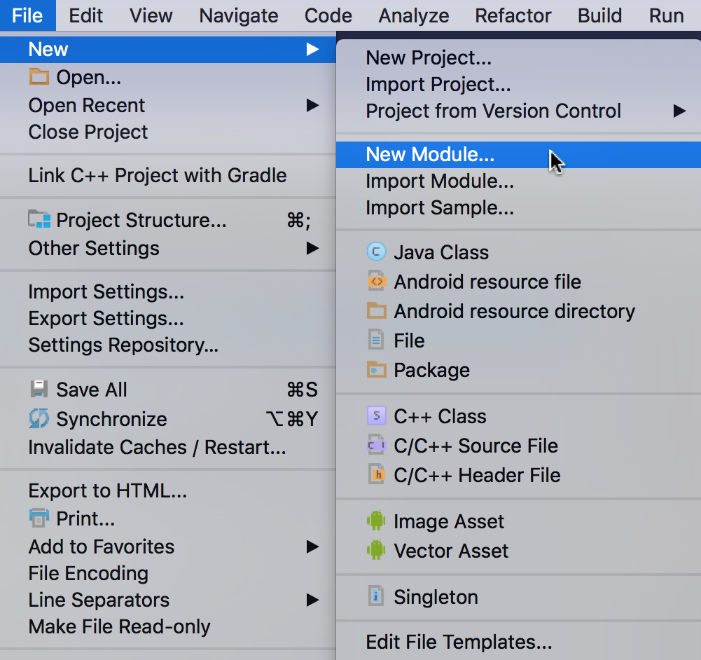
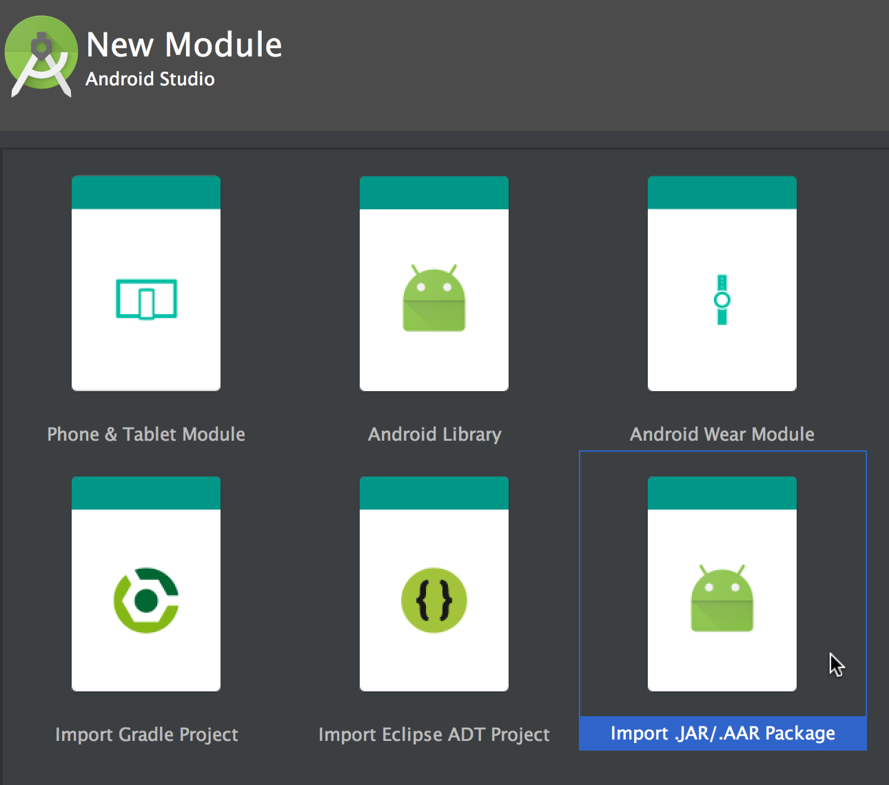
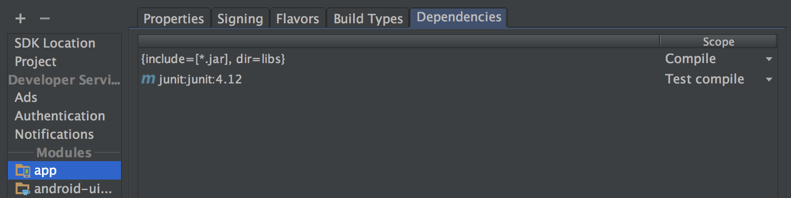
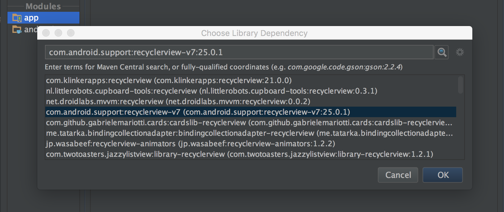

# DJI UILibrary for Android

## What is This?

The UILibrary is a suite of product agnostic UI objects that fast tracks the development of iOS applications using the [DJI Mobile SDK](http://developer.dji.com/mobile-sdk/).

## Get Started Immediately

You can find the followings for Android:

1. UI Library Sample App: Showcases Widgets and Panels. Also shows two examples of customizing widgets through subclassing.
2. `android-uilib-release.aar`: Includes Version 1.0.0 of UILibrary and Version 4.0.1 of Android Mobile SDK.(The combined version string is 4.0.1.1.0.0)

### Running the Sample App

You can run the sample application immediately by importing the project in Android Studio and run it. 

> NOTE: Don't forget to add your **DJI App Key** in the Android Manifest file. Click [here](https://developer.dji.com/mobile-sdk/documentation/quick-start/index.html#generate-an-app-key) for more information on obtaining App Key.

### Integrating UI Library into Your Apps

**1.** Open your project in [Android Studio](https://developer.android.com/studio/index.html).

**2.** Create a new AAR module by going through the menu (as shown below) : File -> New -> New Module.

**3.** Choose "Import .JAR/.AAR Package" item and click on Next button.

**4.** Choose path of AAR file that is downloaded and name the subproject.

**5.** Go to your application module settings and click on the dependencies tab.

**6.** Click on **+** sign and add module, select the module named in step 4, select OK to dismiss add module dialog.

![] (images/androidAddModule.png)

**7.** Click on + sign again and add a library. Search for recyclerview, select android.support:recyclerview-v7 and click OK to dismiss add library dialog.

**8.** Click OK to dismiss module settings dialog.

## Learn More about DJI UI Library

Please visit [UI Library Introduction](http://developer.dji.com/mobile-sdk/documentation/introduction/ui_library_introduction.html) for more details.

## Development Workflow

From registering as a developer, to deploying an application, the following will take you through the full Mobile SDK Application development process:

- [Prerequisites](https://developer.dji.com/mobile-sdk/documentation/application-development-workflow/workflow-prerequisits.html)
- [Register as DJI Developer & Download SDK](https://developer.dji.com/mobile-sdk/documentation/application-development-workflow/workflow-register.html)
- [Integrate SDK into Application](https://developer.dji.com/mobile-sdk/documentation/application-development-workflow/workflow-integrate.html)
- [Run Application](https://developer.dji.com/mobile-sdk/documentation/application-development-workflow/workflow-run.html)
- [Testing, Profiling & Debugging](https://developer.dji.com/mobile-sdk/documentation/application-development-workflow/workflow-testing.html)
- [Deploy](https://developer.dji.com/mobile-sdk/documentation/application-development-workflow/workflow-deploy.html)

## Feedback

We’d love to have your feedback as soon as possible. Reach out to us when you hit roadblocks, or want to talk through something. At a minimum please let us know:

- What improvements would you like to see?
- What is hard to use or inconsistent with your expectations?
- What is good?
- Any bugs you come across.

## Support

You can get support from DJI with the following methods:

- [**DJI Forum**](http://forum.dev.dji.com/en)
- Post questions in [**Stackoverflow**](http://stackoverflow.com) using [**dji-sdk**](http://stackoverflow.com/questions/tagged/dji-sdk) tag
- dev@dji.com

