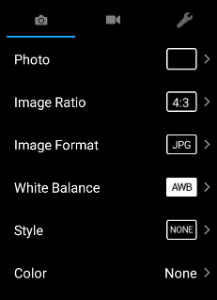
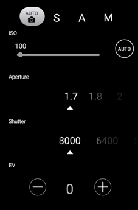
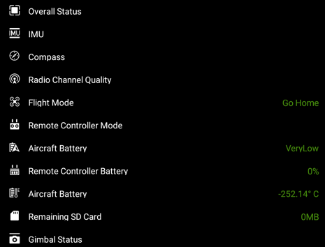

# DJI UILibrary for Android

## What is This?

* DJI UILibrary is a visual framework consisting of UI Elements. It helps you simplify the creation of DJI Mobile SDK based apps in Android.
* With similar design to DJI Go,UI Elements allow you to create consistent UX between your apps and DJI apps.
* With the ease of use, UILibrary let you focus more on business and application logic. 
* UILibrary is implemented using “subscription keys” (DJIKey ) feature that was introduced since DJI SDK Mobile 4.0.1.

## Overview

There are two types of UI elements: Widgets and Panels.

### What are Widgets?

Widgets are views to show information or buttons to take actions. See below for examples of Widgets:

<html>

<table class="table-pictures">

  <tr valign="top">
    <td>
Aircraft Battery Percentage 
</td>
    <td>
Flight Mode 
</td>
    <td>
Video Signal Strength 
</td>
    <td>
Return to Home Button 
</td>
  </tr>

  <tr>
    <td align="center"></td>
    <td align="center"></td>
    <td align="center"></td>
    <td align="center"></td>
  </tr>

</table>
</html>

These Widgets have already been linked to relevant DJIKey.They require from very little to no time for setting up. Once added to the screen, Widgets will automatically update according to information changes.

#### Customize a Widget

Depends on your need of modifying UI Widgets you can customize widgets in two ways with the UILibrary Beta:

1) **Asset Swap**:

- **What is it for**: to keep the Widget’s original behavior and overall look, only change out some assets

- **How is it done**:

   **1.** Rename AAR file to have a zip extension 

   **2.** Unzip AAR file
   
   **3.** Replace assets in following directories:

   - res/drawable 
   - res/drawable-hdpi-v4 
   - res/drawable-mdpi-v4 
   - res/drawable-xhdpi-v4 
   - res/drawable-xxhdpi-v4 
   - res/drawable-xxxhdpi-v4

   **4.** Zip file and rename to replace the original AAR file

> Note: They are required to be of the same pixel dimensions as the original ones.

2) **Subclassing**:

- **What is it for**: To completely change to behavior and the look of Widgets.
- **How is it done**:

  1. **Override** `void initView(Context var1, AttributeSet var2, int var3)` and inflate/initialize your custom layout in there. Remember to **not call super.initView()**.
  2. To get updated with information changes, override methods with the name follow `onXXXChange` pattern. Ex: `onBatteryPercentageChange(int percentage)` in `BatteryWidget` . This method will be called everytime battery percentage changes. Overriding this method will give you integer value of battery percentage. Remember to **not call super.onXXXChange()**.
  3. To perform some actions to aircraft, use(call) methods with the name follow `performXXXAction` pattern. 

Other ways of customizations would be introduced in future versions.

### Panels

Panels are complex menus and settings views. See below for examples of Panels:

<html>

<table class="table-pictures">

  <tr valign="top">
    <td>
Camera Settings Panel 
</td>
    <td>
Camera Exposure Settings Panel 
</td>
    <td>
Preflight Checklist 
</td>
  </tr>

  <tr>
    <td align="center"></td>
    <td align="center"></td>
    <td align="center"></td>
  </tr>

</table>
</html>

#### Customize a Panel

Due to Panel’s complex nature, in Beta, DJI does not offer a way to customize their looks and functionalities. This may change in future releases.

## Get Started

As part of beta, you can find the followings for Android:

1. UI Library Sample App: Showcases Widgets and Panels. Also shows two examples of customizing widgets through subclassing.
2. `DJIUILibrary.aar`: Includes Version 1.0.0 of UILibrary and Version 4.0.1 of Android Mobile SDK.( The combined version string is 4.0.1.1.0.0)

### Running the Sample App

You can run the sample application immediately by importing the project in Android Studio and run it. 

> NOTE: Don't forget to add your DJI App Key in the Android Manifest file. Click [here](https://developer.dji.com/mobile-sdk/documentation/quick-start/index.html#generate-an-app-key) for more information on obtaining App Key.

### Integrating UI Library into Your Apps

**1.** Open your project in [Android Studio](https://developer.android.com/studio/index.html).

**2.** Create a new AAR module by going through the menu (as shown below) : File -> New -> New Module.

**3.** Choose "Import .JAR/.AAR Package" item and click on Next button.

**4.** Choose path of AAR file that is downloaded and name the subproject.

**5.** Go to your application module settings and click on the dependencies tab.

**6.** Click on **+** sign and add module, select the module named in step 4, select OK to dismiss add module dialog.

![] (images/androidAddModule.png)

**7.** Click on + sign again and add a library. Search for recyclerview, select android.support:recyclerview-v7 and click OK to dismiss add library dialog.

**8.** Click OK to dismiss module settings dialog.

## Feedback

We’d love to have your feedback as soon as possible. Reach out to us when you hit roadblocks, or want to talk through something. At a minimum please let us know:

- What improvements would you like to see?
- What is hard to use or inconsistent with your expectations?
- What is good?
- Any bugs you come across.

## Contact

You can get in touch with someone from DJI with the following methods:

- [**DJI Forum**](http://forum.dev.dji.com/en)
- Post questions in [**Stackoverflow**](http://stackoverflow.com) using [**dji-sdk**](http://stackoverflow.com/questions/tagged/dji-sdk) tag
- dev@dji.com

